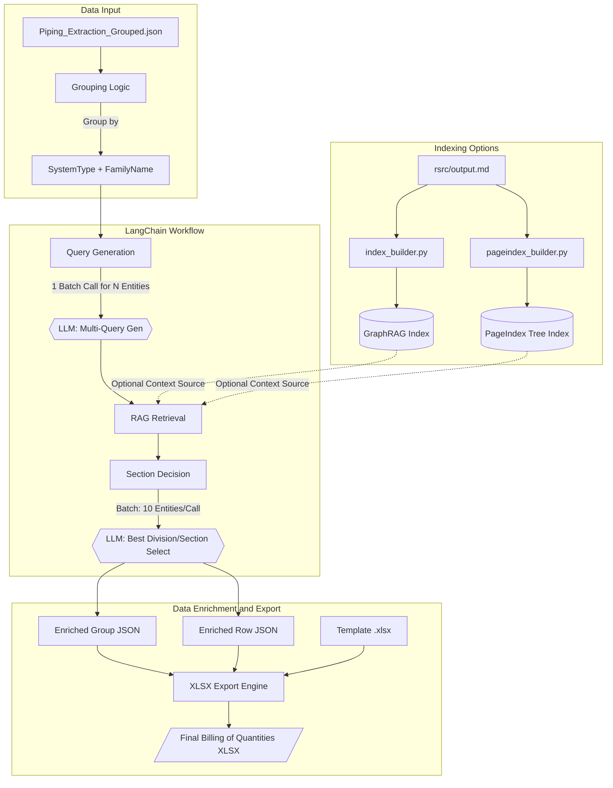

# AI-Assisted Billing of Quantities Enrichment and Export Workflow

This project helps convert raw piping extraction data into a clean billing of quantities workbook that is easier for teams to review, validate, and hand over.

## Overview
This project builds a billing of quantities export pipeline from:
- `rsrc/Piping_Extraction_Grouped.json`

It:
1. Groups by `SystemType + FamilyName`
2. Generates multi-queries with a LangChain LLM (single batch call for all entities)
3. Retrieves local context from `--rag-data-path`
4. Selects the best Division/Section per grouped entity (batched LLM calls)
5. Writes enriched JSON outputs
6. Exports a billing of quantities XLSX with one sheet per Division and Sections under each Division

## Entry Point
- `main.py` (delegates to the workflow runner module)

## Run
```bash
python main.py `
  --input rsrc/Piping_Extraction_Grouped.json `
  --grouped-output rsrc/Piping_Extraction_Grouped_with_rag_sections.json `
  --enriched-output rsrc/Piping_Extraction_Grouped_entries_with_rag_sections.json `
  --output-xlsx rsrc/Piping_Extraction_Grouped_sorted_billing_of_quantities.xlsx `
  --template rsrc/Billing_of_Quantities-TLN.xlsx `
  --rag-data-path rsrc/output.md `
  --query-count 2
```

Default behavior (if flags are omitted):
- `--query-count` defaults to `2` (3 total queries including the seed)
- `--rag-data-path` defaults to `rsrc/output.md`
- `--expected-entity-count` is auto-detected from grouped entities

Execution model:
- For `N` grouped entities, workflow attempts:
- `1` LLM call for query generation (all `N` entities)
- Section decisions in batches of `10` entities per LLM call
- Query generation is strict batch mode (single call, no per-entity fallback).
- Section decision is strict batch mode (no per-entity fallback).

Timeouts:
- LLM request timeout is `120` seconds by default.

## Outputs
- Group-level enriched JSON: `rsrc/Piping_Extraction_Grouped_with_rag_sections.json`
- Row-level enriched JSON: `rsrc/Piping_Extraction_Grouped_entries_with_rag_sections.json`
- Billing of quantities Excel: custom path from `--output-xlsx`

## Indexing Approaches Used and Compared
This repository includes and uses both indexing approaches:

1. GraphRAG path:
- Script: `src/index_builder.py`
- Purpose: builds a GraphRAG index from the source markdown and supports graph-oriented retrieval workflows.

2. PageIndex path:
- Script: `src/pageindex_builder.py`
- Purpose: builds a hierarchical page/tree index from markdown, independent of GraphRAG.

Comparison summary used in this project:
- GraphRAG provides graph-centric structure and richer relationship-oriented retrieval flows.
- PageIndex provides a lightweight, markdown-first indexing path with simpler setup.
- Both were used for indexing experiments and compared as alternative retrieval foundations for the same billing of quantities workflow.

## Build PageIndex Index
```bash
python src/pageindex_builder.py --md-path rsrc/output.md
```

Notes:
- Requires `CEREBRAS_API_KEY` and `CEREBRAS_MODEL` in `.env`.
- First run clones `https://github.com/VectifyAI/PageIndex` into `.vendor/pageindex`.
- Output is written to `pageindex_real_index/output/<input_name>_pageindex.json`.

## Build GraphRAG Index
```bash
python src/index_builder.py
```

## Configuration
Set environment variables in `.env`:
- LLM provider and model settings
- `CEREBRAS_API_KEY`
- `CEREBRAS_MODEL`
- `LANGFUSE_PUBLIC_KEY` (optional, tracing)
- `LANGFUSE_SECRET_KEY` (optional, tracing)
- `LANGFUSE_BASE_URL` (optional, tracing)

Langfuse notes:
- If all `LANGFUSE_*` variables are set and the `langfuse` package is available, LLM calls are traced automatically.
- If not set, workflow runs normally without tracing.

## Tests
Run workflow and indexer tests:
```bash
python -m unittest discover -s tests -p "test_*.py" -v
```

Test artifacts are written to:
- `tests/artifacts/workflow_unit_test_results.csv`
- `tests/artifacts/*_from_test_*.xlsx`
- `tests/artifacts/*_from_test_preview_*.csv`

## Runtime Logs
The workflow prints colored progress logs, including:
- overall start/end time
- grouped entity counts
- per-entity retrieval progress
- query generation/decision timings
- output file write confirmations

### Diagram

